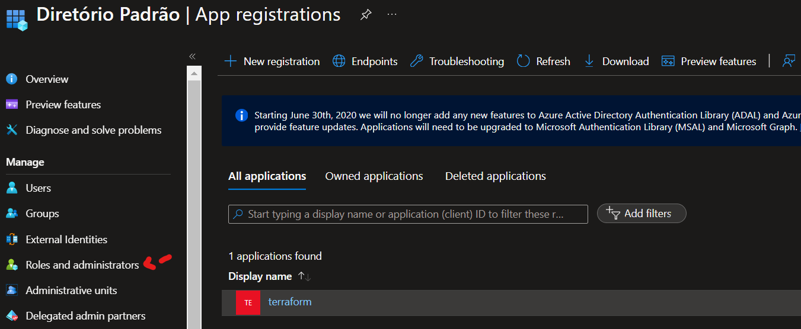
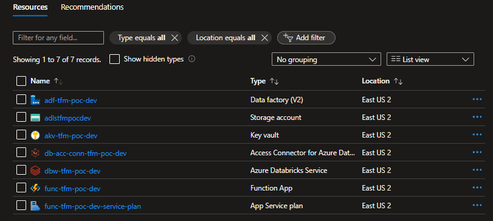
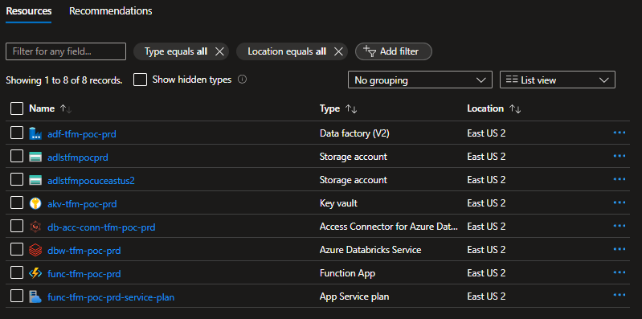

# terraform-workspace-modules

# Documentação do Projeto: Infraestrutura como Código (IaC) na Azure

## Índice
1. [Visão Geral do Projeto](#visão-geral-do-projeto)
2. [Arquitetura do Sistema](#arquitetura-do-sistema)
3. [Tecnologias Utilizadas](#tecnologias-utilizadas)
4. [Pipeline de CI/CD](#pipeline-de-cicd)
5. [Considerações de Segurança](#considerações-de-segurança)
6. [Boas Práticas](#boas-práticas)
7. [Variáveis Necessárias](#variáveis-necessárias)
8. [Setup](#setup)
9. [Evidências dos Recursos Criados](#evidencias-dos-recursos-criados)

## Visão Geral do Projeto
Este projeto implementa uma infraestrutura na Azure utilizando Terraform para gerenciar recursos de forma automatizada, garantindo consistência e reprodutibilidade.

## Arquitetura do Projeto
A arquitetura do projeto inclui:
- **ADD Groups:** Grupos no Entra ID para gerenciamento centralizado de usuários e permissões.
- **Resource Groups:** Agrupamentos de recursos da Azure por ambiente (desenvolvimento, produção, homologação) para facilitar a organização e o gerenciamento.
- **Key Vault:** Serviço gerenciado de banco de dados SQL para armazenamento e gerenciamento de dados relacionais.
- **SQL Server:** Servidor SQL para gerenciamento de banco de dados.
- **Storage Account:** Contas de armazenamento para dados persistentes, incluindo blobs, arquivos, filas e tabelas.
- **Virtual Machines:** MMáquinas virtuais que hospedam sistemas operacionais e aplicações, como o Integration Runtime do Data Factory.
- **Data Factory:** Plataforma de integração de dados para criar, agendar e gerenciar pipelines de dados.
- **Access Connector:** Conector que facilita a integração entre o Metastore e a Storage Account.
- **Azure DevOps:** Ferramenta para planejamento de projetos, versionamento de código e CI/CD.
- **Azure Databricks:** Plataforma de análise de dados baseada em Apache Spark para ingestão e processamento de grandes volumes de dados.
- **Azure Function:** Serviço de computação sem servidor para executar funções em resposta a eventos.
- **Roles**: Definição de roles para controle de acesso e permissões de usuários nos recursos da Azure.
- **Unity Catalog:** Serviço de gerenciamento de metadados que inclui metastore, credenciais de armazenamento, localização externa, catálogo e schemas.

## Tecnologias Utilizadas
- **Terraform:** Ferramenta de IaC para definir e provisionar a infraestrutura.
- **Git:** Sistema de controle de versão.
- **GitHub Actions:** Ferramenta de CI/CD para automação de pipelines.
- **Terraform Docs:** Gerador de documentação automática do Terraform.

## Pipeline de CI/CD
É criada uma pipeline que é possível realizar o plan e o apply do projeto através de uma trigger manual. 

## Considerações de Segurança
- Segregação de Ambientes: Utilize diferentes Resource Groups para ambientes de desenvolvimento, homologação e produção.
- Gerenciamento de Senhas e Segredos: Utilize Azure Key Vault para armazenar senhas e segredos de maneira segura.
- Controle de Acesso: Implemente políticas de acesso baseadas em funções (RBAC) para controlar quem pode gerenciar os recursos.

## Boas Práticas
- Modularização: Separe a infraestrutura em módulos Terraform para facilitar o reuso e a manutenção.
- Revisão de Código: Utilize Pull Requests e revisões de código para garantir a qualidade e a segurança das mudanças.
- Documentação: Documente os recursos e scripts de IaC para facilitar a compreensão e a colaboração.

## Variáveis Necessárias
- ARM_CLIENT_ID: Client ID da App Registration.
- ARM_CLIENT_SECRET: Client Secret da App Registration.
- ARM_SUBSCRIPTION_ID: Subscription ID.
- ARM_TENANT_ID: Tenant ID da App Registration.
- AZDO_ORG_SERVICE_URL: Link da organização do Azure DevOps (https://dev.azure.com/name-of-the-org).
- TF_VAR_DATABRICKS_ACCOUNT_ID: ID da conta do Databricks.
- TF_VAR_DATABRICKS_SP_TERRAFORM: ID do Service Principal do Terraform.
- TF_VAR_DATABRICKS_USER_EMAIL: Email do usuário principal do Databricks.
- TF_VAR_METASTORE_ID: ID do Metastore. É mostrado após o Apply dos recursos da pasta "metastore".
- TF_VAR_PREFIX_NAME: Prefixo do projeto. Será utilizado no nome dos recursos.
- TF_VAR_SQL_SERVER_USER: Usuário do SQL Server.
- TF_VAR_SQL_SERVER_PASSWORD: Senha do SQL Server.
- TF_VAR_VM_USER: Usuário da VM.
- TF_VAR_VM_PASSWORD: Senha da VM.

## Setup

- Create a App Registration and a client secret
- Grant a Administrative Role

Access the option Roles and administrators

Add the service principal to role “Global Administrator”

- Grant a Subscription Role

In subscription, access the option “Access control (IAM)”, and the option “Role assignments”.

After, access the option “Add” and “Add role assignment”, and click in the option “Privileged administrator roles”.

Click in the Owner, after click Next. In the next page, in the option “Assign access to”, select an option “User, group or service principal”. After search your service principal created,

After, select the option “Allow user to assign all roles except privileged administrator roles Owner, UAA, RBAC (Recommended)” in page “Conditions”.

Select the option “Review + assign”, and is done.

- Add the service principal in Databricks

Login in [https://accounts.azuredatabricks.net/](https://accounts.azuredatabricks.net/), go to option “User management”, and access the option “Service principals”.

Add the service principal, and in the option “Management, click in the option “Microsoft Entra ID managed”.

Fill in the application id of service principal created, and name of service principal created.

After created, click in the service principal, abd in the tab “Roles”, grant the role name “Account admin”, which could manage workspaces, user and groups.

## Evidências dos Recursos Criados

### Recursos criados no Grupo de Recursos de Dev

### Recursos criados no Grupo de Recursos de Prod

### Metastore 

### Catálogos 

