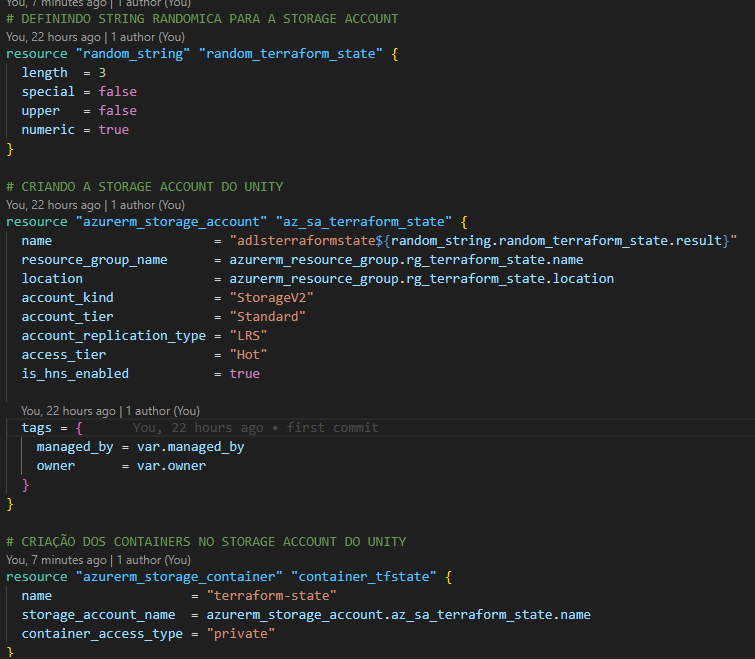

Na documentação é detalhado o provisionamento dos recursos da pasta backend. 

## Variáveis Necessárias 
```powershell
$env:ARM_CLIENT_ID="" # Client ID da App Registration
$env:ARM_TENANT_ID="" # Tenant ID da App Registration
$env:ARM_SUBSCRIPTION_ID="" # ID da Subscription
$env:ARM_CLIENT_SECRET="" # Client Secret da App Registration
```

## Detalhamento

Na pasta backend, são criados os recursos de resource group e storage account para armazenamento do arquivo .tfstate, arquivo que guarda todo o histórico dos arquivos provisionados.

Primeiro, é criado o resource group e logo após a storage account e o container onde ficará armazenado o arquivo .tfstate.



## Variáveis Utilizadas 
| Name | Description | Type | Default | Required |
|------|-------------|------|---------|:--------:|
| <a name="input_managed_by"></a> [managed\_by](#input\_managed\_by) | tag de quem esta gerenciando os recursos (criacao e exclusao) | `string` | `"terraform"` | no |
| <a name="input_owner"></a> [owner](#input\_owner) | tag do owner | `string` | `"bruno"` | no |

[Veja mais detalhes sobre os recursos criados aqui](DOCS.md)