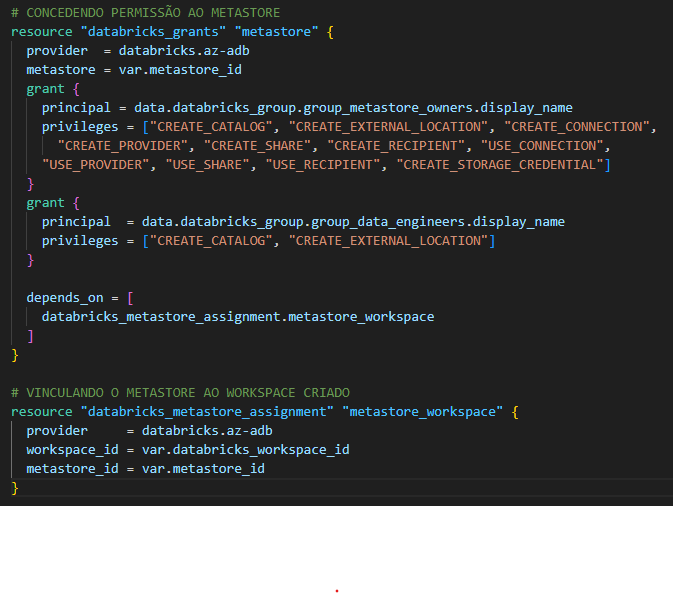
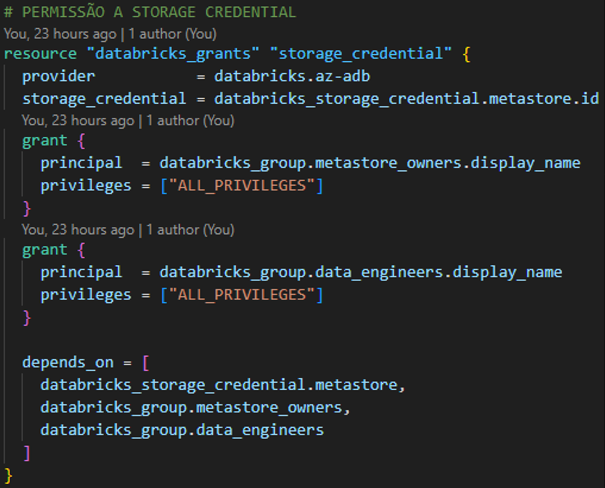
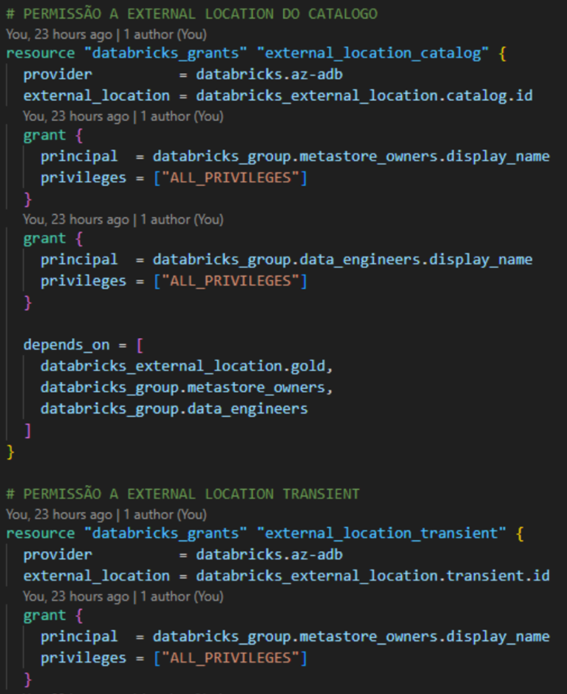
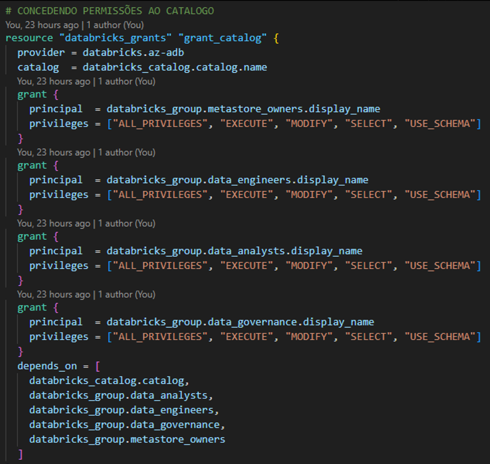

## Contexto Geral

Na documentação é detalhado o provisionamento dos recursos da pasta infra, que são recursos 
que necessitam ser criados duas vezes, a partir dos workspaces existentes.
Por padrão, o projeto utiliza os workspaces dev e prd.  

## Variáveis necessárias para o deploy

```powershell
$env:ARM_CLIENT_ID="" # Client ID da App Registration
$env:ARM_TENANT_ID="" # Tenant ID da App Registration
$env:ARM_SUBSCRIPTION_ID="" # ID da Subscription
$env:ARM_CLIENT_SECRET="" # Client Secret da App Registration
$env:AZDO_PERSONAL_ACCESS_TOKEN="" # Token do Azure DevOps
$env:AZDO_ORG_SERVICE_URL="https://dev.azure.com/organization-example" # Link da organization do DevOps
$env:azure_client_secret="" # Client Secret da App Registration para o Provider
$env:databricks_account_id="" # Account ID do Databricks
$env:databricks_sp_terraform_id="" # ID do Service Principal Criado (É possível obter pela API)
$env:databricks_user_id="" # ID do usuário do Databricks (É possível obter pela API)
$env:sql_server_user="" # Usuário do SQL Server a ser criado
$env:sql_server_password="" # Senha do SQL Server a ser criado
$env:vm_user="" # Usuário da VM
$env:vm_password="" # Senha da VM
```

## Detalhamento

O documento detalha o provisionamento dos recursos na Azure, que envolve a criação dos recursos utilizados em projetos de engenharia de dados.

Nesta pasta, utilizamos módulos para o provisionamento de recursos, com o objetivo de ter o código organizado, utilizando as boas práticas.

### Access Connector

Neste módulo é realizada a criação do access connector, com o objetivo de realizar a conexão entre o metastore e a storage account.

### Data Factory

É feita a criação do Data Factory, e também a criação do linked service do tipo Key Vault. Este último recurso é criado somente após a criação da Key Vault.

### Databricks

Para o Databricks, é realizada a criação do workspace, do cluster all purpose e também do cluster SQL warehouse. 

### Databricks Metastore

Módulo que provisiona os recursos restantes, necessários para o unity catalog, como storage credential, external location, catálogo e schemas. 

Também são concedidos grants para que o usuário consiga criar os recursos sem erros.

### Function App

É criado o service plan e um recurso de Function App do tipo Linux.

### Key Vault

É feita a criação do recurso Key Vault. 

### SQL Server

Neste módulo criamos o SQL Server e o SQL Database do tipo Basic, além da liberação do banco para todos os IPs.

### Storage Account

É realizada a criação da storage account com os respectivos containers.

### Secrets

São criadas 4 secrets com os dados da App Registration, como Client ID, Object ID, Tenant ID e Secret Value.

### Roles

São criados recursos que definem roles para grupos e recursos.

## Unity Catalog

### Metastore

Já na parte do Metastore, são concedidos os grants abaixo do metastore para os grupos conforme imagem abaixo.



Após isso, é vinculado o metastore ao workspace existente. 

### Storage Credential

É criada uma storage credential e também concedidos grants para os grupos. 



### External Location

São criadas as external locations para o catálogo e os schemas, apontando para o container correspondente.

Para o catálogo, é criada a external location no container metastore.

Também são criadas as external locations para os schemas transient, bronze, silver e gold, além dos grants.



### Catalog

É criado o catálogo e também os grants para os grupos.



### Schema

São criados os schemas transient, bronze, silver e gold, além dos grants para os grupos.

### Variáveis Utilizadas

| Name | Description | Type | Default | Required |
|------|-------------|------|---------|:--------:|
| <a name="input_azure_client_secret"></a> [azure\_client\_secret](#input\_azure\_client\_secret) | Client Secret do Azure | `string` | n/a | yes |
| <a name="input_databricks_account_id"></a> [databricks\_account\_id](#input\_databricks\_account\_id) | ID da conta do Databricks | `string` | n/a | yes |
| <a name="input_databricks_sp_terraform_id"></a> [databricks\_sp\_terraform\_id](#input\_databricks\_sp\_terraform\_id) | ID do service principal terraform no Databricks | `string` | n/a | yes |
| <a name="input_databricks_user_id"></a> [databricks\_user\_id](#input\_databricks\_user\_id) | ID do usuario principal no Databricks | `string` | `"6625035817707273"` | no |
| <a name="input_location"></a> [location](#input\_location) | Localização do resource group | `string` | `"East US 2"` | no |
| <a name="input_managed_by"></a> [managed\_by](#input\_managed\_by) | tag de quem está gerenciando os recursos (criação e exclusão) | `string` | `"terraform"` | no |
| <a name="input_metastore_id"></a> [metastore\_id](#input\_metastore\_id) | id do metastore | `string` | n/a | yes |
| <a name="input_metastore_location"></a> [metastore\_location](#input\_metastore\_location) | Localização do metastore | `string` | `"eastus2"` | no |
| <a name="input_metastore_name"></a> [metastore\_name](#input\_metastore\_name) | Nome do metastore | `string` | `"uc-metastore"` | no |
| <a name="input_owner"></a> [owner](#input\_owner) | tag do owner | `string` | `"bruno"` | no |
| <a name="input_prefix_name"></a> [prefix\_name](#input\_prefix\_name) | nome de prefixo do projeto | `string` | `"tfm-bl"` | no |
| <a name="input_sa_containers_name"></a> [sa\_containers\_name](#input\_sa\_containers\_name) | containers a serem criados | `list(any)` | <pre>[<br>  "function-app",<br>  "transient",<br>  "bronze",<br>  "silver",<br>  "gold",<br>  "controller"<br>]</pre> | no |
| <a name="input_sql_server_password"></a> [sql\_server\_password](#input\_sql\_server\_password) | senha do banco | `string` | n/a | yes |
| <a name="input_sql_server_user"></a> [sql\_server\_user](#input\_sql\_server\_user) | usuario do banco | `string` | n/a | yes |
| <a name="input_vm_password"></a> [vm\_password](#input\_vm\_password) | senha da vm | `string` | n/a | yes |
| <a name="input_vm_user"></a> [vm\_user](#input\_vm\_user) | usuario da vm | `string` | n/a | yes |